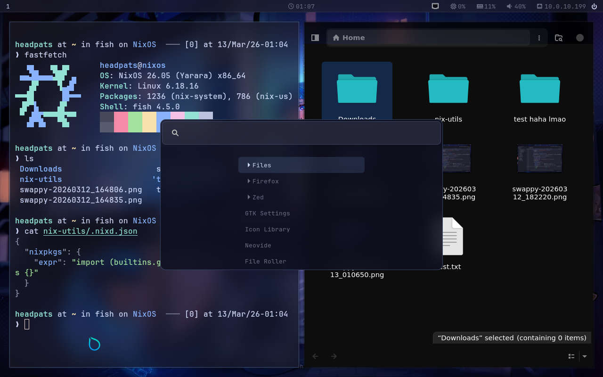
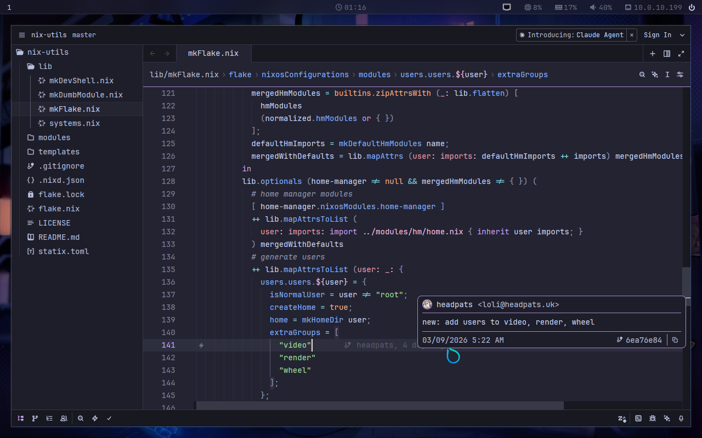

# nut-shells

NixOS flake templates for [nut](https://github.com/Francesco149/nut).

## usage

```sh
nix shell nixpkgs#git   # if you don't have git

mkdir my-config && cd my-config

# replace <template> with the template name. see below for a list
nix flake init -t github:Francesco149/nut-shells#<template>

git init
git add .

# .. or adapt to your current system wide config.
# just make sure to migrate everything over
cp /etc/nixos/configuration.nix ./hosts/nixos/
cp /etc/nixos/hardware-configuration.nix ./hosts/nixos/

nixos-rebuild boot --flake .#nixos
passwd headpats # if the flake has a non-root user, set the password
reboot
```

if there's a non-root user, the default username is always `headpats` with no
password configured. remember to run `passwd headpats` or whatever you rename
the user to.

if for whatever reason the config doesn't boot, you can select the previous
generation in grub to roll back. NixOS perks!

refer to the [nut docs](https://github.com/Francesco149/nut) for next steps.

---

## templates

| name                    | description                                       |
| ----------------------- | ------------------------------------------------- |
| [`default`](#default)   | blank flake using nut                             |
| [`hyprland`](#hyprland) | tiling desktop with frosted catpuccino aesthetics |

### `default`

blank flake using nut

---

### `hyprland`

tiling desktop with frosted catpuccino aesthetics





---

## maintaining this repo

after adding, removing, or renaming a template, regenerate the nix attrset and
this README:

```sh
nix run nixpkgs#python3 -- ./gen-templates.py
```

then open `README.md` in vscode and save to auto-format.
